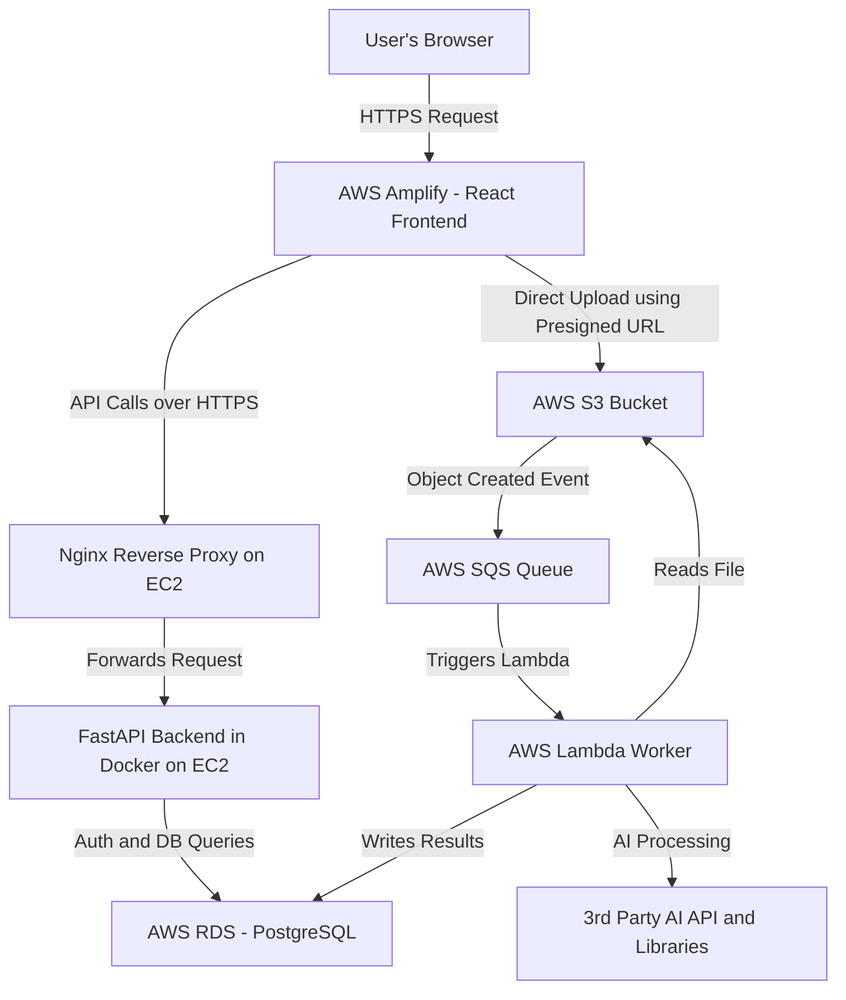

# **ProductPulse \- AI-Powered Customer Feedback Analysis Platform**

ProductPulse is a full-stack, multi-tenant web application designed to empower businesses by transforming raw customer feedback into actionable insights. It leverages a modern, event-driven architecture and AI to automate the process of topic modeling, summarization, and sentiment analysis from large CSV datasets.

## **🚀 Live Demo**

* **Frontend Application:** https://main.d1d3jiir25gjvh.amplifyapp.com/ 
* **Backend API:** https://api.devangsvaghani.me 

## **✨ Key Features**

* **Secure Multi-Tenant Authentication**: Robust login system with HttpOnly cookie-based JWT authentication and distinct roles for regular users and administrators.  
* **User Dashboard**: A personalized dashboard for users to upload CSV files, view their upload history, and track the real-time status of their analysis (Processing, Completed, Failed).  
* **Detailed Analysis View**: Users can click on any completed upload to see a detailed breakdown of automatically identified topics and their corresponding AI-generated summaries and sentiment scores.  
* **Protected Admin Control Panel**: A secure admin section for full CRUD (Create, Read, Update, Delete) user management.  
* **Platform Analytics**: The admin dashboard provides a high-level overview of key metrics, including total users, total files processed, total summaries generated, and a breakdown of analysis statuses.  
* **Asynchronous AI Processing**: File uploads trigger a decoupled, asynchronous background process using AWS SQS and Lambda, ensuring the UI remains responsive and the system is highly scalable.  
* **Robust Validation**: Implements comprehensive backend and frontend validation for filenames, file types, and CSV content to ensure data integrity and a smooth user experience.

## **🏛️ System Architecture**

ProductPulse is built on a scalable, event-driven architecture designed to decouple the user-facing web services from the intensive backend processing. This ensures high availability and resilience.

**Workflow Explanation:**

1. A user logs in via the **React Frontend** hosted on **AWS Amplify**.  
2. The frontend communicates with the **FastAPI Backend** (running in a Docker container on an **EC2** instance) via **Nginx**, which acts as a secure reverse proxy. The backend handles authentication, user management, and other requests by querying the **RDS Database**.  
3. To upload a file, the frontend gets a secure, pre-signed URL from the backend.  
4. The file is uploaded directly from the user's browser to an **S3 Bucket**, minimizing load on the backend server.  
5. The new file in S3 automatically sends an event notification to an **SQS Queue**.  
6. The SQS message triggers the **AWS Lambda Worker**, which downloads the file, performs AI analysis, and writes the results back to the RDS database.

## **🚀 Technology Stack**

A selection of modern, scalable, and production-ready technologies were used to build this application.

| Area | Technology |
| :---- | :---- |
| **Frontend** | React.js, Vite, Tailwind CSS, Axios, React Router, react-hot-toast, Papaparse |
| **Backend API** | Python, FastAPI, Gunicorn, pydantic-settings, Passlib, python-jose |
| **Database** | PostgreSQL (hosted on AWS RDS) |
| **AI / ML Worker** | Python, Scikit-learn (Topic Modeling), NLTK (Sentiment), python-json-logger |
| **Deployment & Infrastructure** | Docker, AWS (EC2, S3, SQS, Lambda, Amplify, RDS), Nginx, GitHub |

## **🛠️ Local Setup & Installation**

To run this project on your local machine, please follow these steps.

### **Prerequisites**

* Node.js (v18 or newer)  
* Python (v3.11 or newer)  
* Docker & Docker Desktop  
* An AWS account with configured RDS, S3, and SQS services.

### **1\. Clone the Repository**

`git clone https://github.com/devangsvaghani/ProductPulse.git`

`cd ProductPulse`

### **2\. Backend Setup**

1. **Navigate to the backend directory:**  
   `cd backend`

2. **Create a Python virtual environment and activate it:**  
   `python3 \-m venv .venv`
   
   `source .venv/bin/activate` (for mac)

   `.\.venv\Scripts\activate` (for windows)

4. **Install dependencies:**  
   `pip install \-r requirements.txt`

5. **Configure Environment Variables:**  
   * Create a `.env` file.  
   * Fill in the file with all your credentials (Database URI, AWS keys, JWT Secret, etc.)

6. **Run the Backend Server:**  
   `uvicorn main:app --reload`

   The API will be available at http://localhost:8000.

### **3\. Frontend Setup**

1. **Navigate to the frontend directory (in a new terminal):**  
   `cd frontend`

2. **Install dependencies:**  
   `npm install`

3. **Configure Environment Variables:**  
   * Create a `.env` file in the frontend root.  
   * Add the following line:  
     `VITE_API_BASE_URL=http://localhost:8000`

4. **Run the Frontend Development Server:**  
   `npm run dev`

   The application will be available at http://localhost:5173.

### **4\. Deployment**

This application is designed for a full cloud deployment on AWS:

* **Frontend:** The React app is deployed using **AWS Amplify**, which connects to the GitHub repository for continuous deployment and hosts the site on a global CDN.
* **Backend:** The FastAPI application is containerized with **Docker** and deployed on an **Amazon EC2** `t3.micro` instance. **Nginx** is used as a reverse proxy to handle incoming traffic.
* **Worker:** The AI processing script is deployed as a containerized **AWS Lambda function**, triggered by **SQS**.
